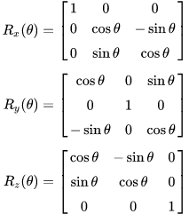

# Spinning 3D Cube

This project features an animation of a 3D cube rotating using trigonometric functions.

## Formula 
<p align="center"></p>

Website to convert it into this expression : 
- K * cos(A) * cos(B) - j * sin(A) * cos(B) + i * sin(B)
- Link : ```https://ar.symbolab.com/```

## Run

To run the project (Linux env)
- Clone : git clone "repository link"
- Check the gcc version : "gcc -v"
- compile the main project file : "gcc main.c -lm" (-lm to link the math library during the compilation)
- Run : ./a.out

## Preview 
<p align="center"></p>

